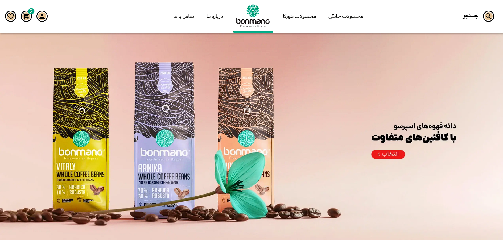
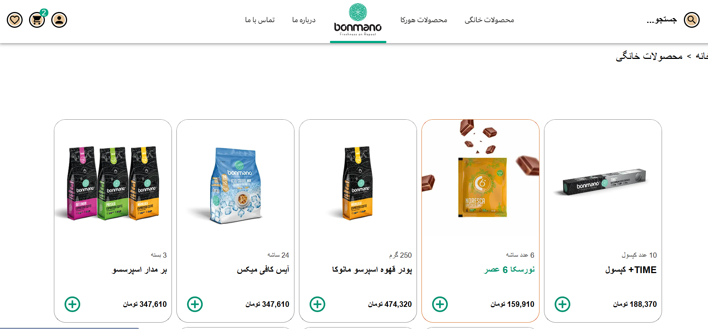
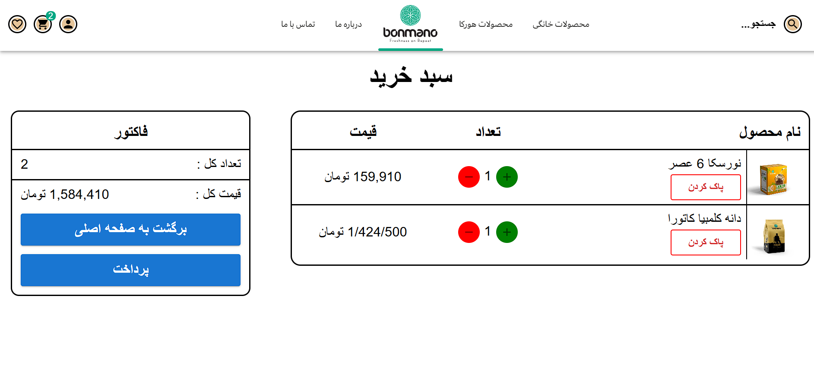

# Shop

  
  
  
  
  
  

#
This shop was built to showcase skills in React, Next.js, and Material-UI (MUI), designed to be fully responsive. I’d really appreciate it if you could take a look and share your feedback with me. Thanks for checking it out!

- Role - Frontend

# ONLINE DEMO

# Technologies Used:
 LocalStorage , API , React , Next.Js , MUI , Zustand
 # SCREEN-SHOT

